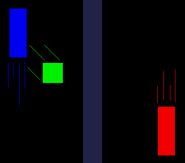
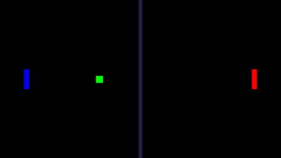
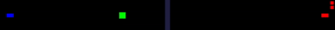

# C Pong SDL 

#### An implementation of the classic pong game in C with SDL2.

---

This is a basic implementation of Pong made in C with SDL2. This was my first attempt using SDL and I made this within
my first few months of learning C, however I'm just publishing it now.

While not fancy, this is a decent enough Pong game. It has proper bouncing, keeps track of points, and can be resized in
nearly any way.

<table>
<tr><td>

</td><td>

</td>
</tr>
</table>

A cool feature with this implementation is that the window can be resized in any way and the game will still be
perfectly functional and arguably playable.

---

### Reflection

Overall this is an *ok* project. If I were to go back I would restructure the project, my `main.c` file handles way too
much logic. I also would have restructured how my rendering is done. The screen wipe is cool but doesn't scale correctly
on higher resolutions.

SDL is *fine* but maybe a bit lower level than I'd prefer. If I were to do this again, I'd heavily
consider [raylib](https://www.raylib.com/) due to its performance and ease of use, as well as my newfound familiarity
with it.

